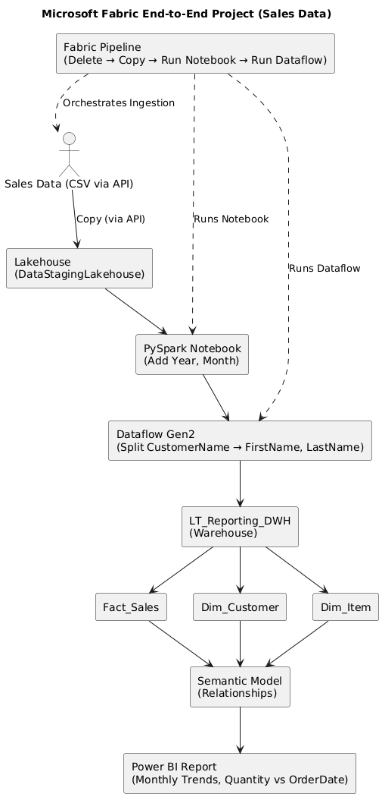

# 🚀 Microsoft Fabric Sales Data Analytics Project

An **end-to-end analytics pipeline** built with **Microsoft Fabric** to demonstrate how raw sales data can be transformed into meaningful insights.  
This project covers everything from **data ingestion** to **reporting** in Power BI.

---

## 🔹 Architecture

---

## 🔹 Project Overview

This project demonstrates a **real-world analytics flow** for Sales data using Microsoft Fabric:

1. **Ingestion**
   - Sales data (CSV via API) is ingested into a **Lakehouse**.
   - Orchestrated using a **Pipeline** with activities: Delete → Copy → Notebook → Dataflow.

2. **Transformation**
   - **PySpark Notebook**: Enriches data with `Year` and `Month` columns.
   - **Dataflow Gen2**: Splits `CustomerName` into `FirstName` and `LastName` → saved into `newsales` table.

3. **Warehouse**
   - Data is loaded into **LT_Reporting_DWH** containing:
     - **Fact_Sales**
     - **Dim_Customer**
     - **Dim_Item**
   - A stored procedure (`Sales.LoadDataFromStagingLakehouse`) manages loading from staging into fact/dim tables.

4. **Semantic Model**
   - One-to-Many relationships defined:
     - `Fact_Sales.CustomerID` → `Dim_Customer.CustomerID`
     - `Fact_Sales.ItemID` → `Dim_Item.ItemID`

5. **Reporting**
   - Power BI connected to the semantic model.
   - Visualizations include:
     - Monthly sales trends 📊
     - Total items sold 🛒
     - Line chart: Quantity vs OrderDate 📈

---

## 🔹 Tech Stack

- **Microsoft Fabric**
  - Lakehouse
  - Pipelines
  - Dataflow Gen2
  - Warehouse
  - Semantic Models
  - Power BI
- **PySpark** (transformations)
- **T-SQL** (schemas, stored procedures)

---

## 📊 Sample Reports

Some of the visuals generated in Power BI:

- **Items sold per month**  
- **Total number of items sold**  
- **Line chart of Quantity vs OrderDate**  

---
